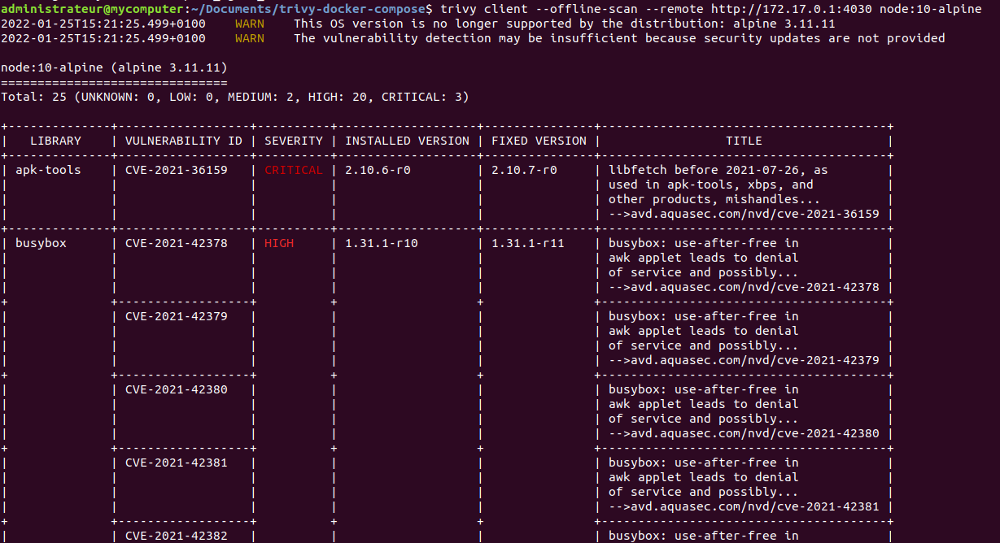

# Trivy docker-compose

Deployment-ready docker compose configuration and instructions to use Trivy on your infrastructure and CIs.

## Installation

### Download latest vulnerabilities

Run the following commands :

```bash
mkdir trivy-data
docker run --rm -v ./trivy-data:/root/.cache/db aquasec/trivy:0.29.2 image --download-db-only
```

### Run Trivy server

```bash
docker-compose up -d
```

## Run scan (local)

```bash
# Install client
wget https://github.com/aquasecurity/trivy/releases/download/v0.29.2/trivy_0.29.2_Linux-64bit.deb
sudo dpkg -i trivy_0.29.2_Linux-64bit.deb

# Run
trivy client --offline-scan --remote http://172.17.0.1:4030 "$FULL_IMAGE_NAME"
```

- Image avec vulnérabilité : `node:10-alpine`
- Image sans vulnérabilité : `alpine:3.12`

This will look like this :



## Run scan (CI)

Trivy can be [integrated to a GitLab CI](https://aquasecurity.github.io/trivy/v0.29.2/advanced/integrations/gitlab-ci/).

### GitLab CE

1. Download Trivy client binaries

    ```bash
    wget https://github.com/aquasecurity/trivy/releases/download/v0.29.2/trivy_0.29.2_Linux-64bit.tar.gz
    ```

2. In a `docker:dind` image CI run

    ```bash
    mkdir trivy_bin && tar xf trivy_0.29.2_Linux-64bit.tar.gz -C trivy_bin/

    ./trivy_bin/trivy --exit-code 1 --cache-dir .trivycache/ --severity CRITICAL --no-progress "$FULL_IMAGE_NAME"
    ```

    This command will make the container exit 1 on CRITICAL vulnerabillity found.

### GitLab EE

Check the [template from the official documentation](https://aquasecurity.github.io/trivy/v0.29.2/advanced/integrations/gitlab-ci/) so you can benefit of a nice report formating.
